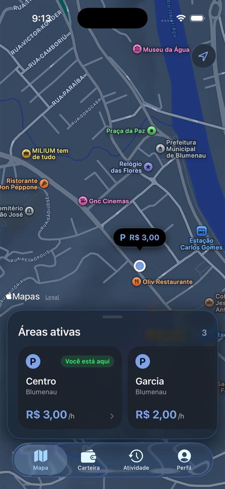
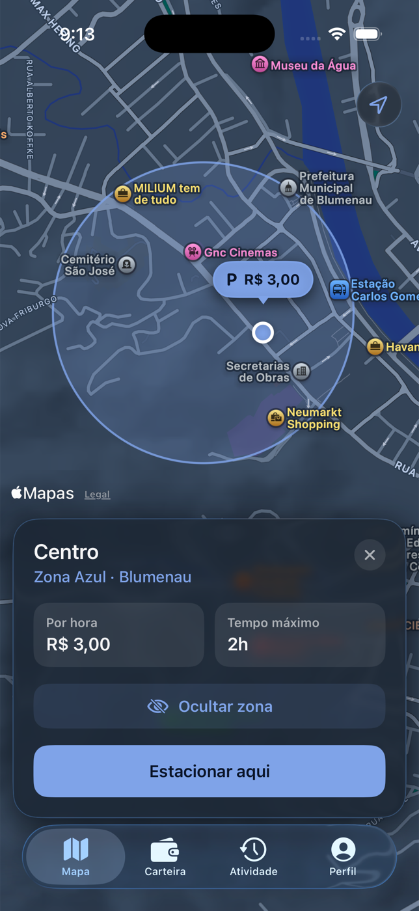
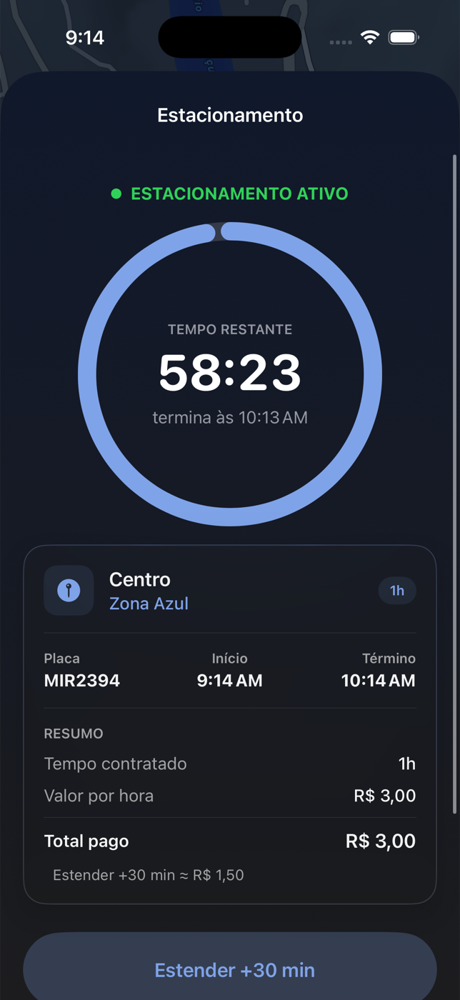
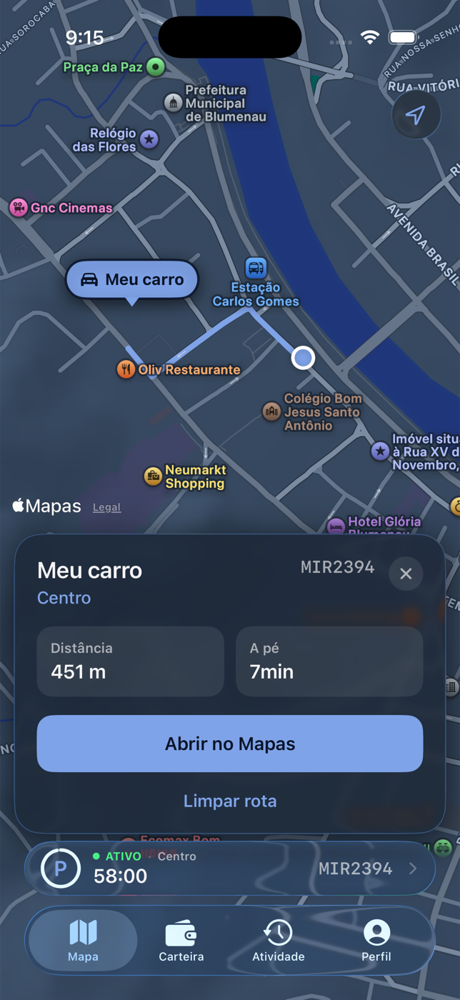
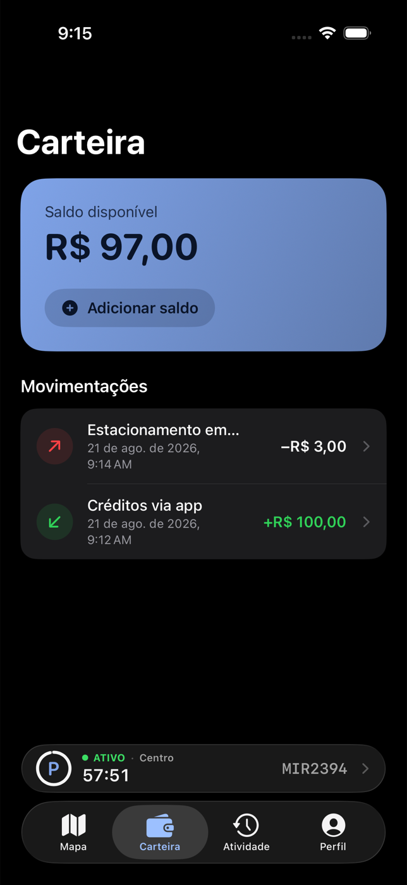
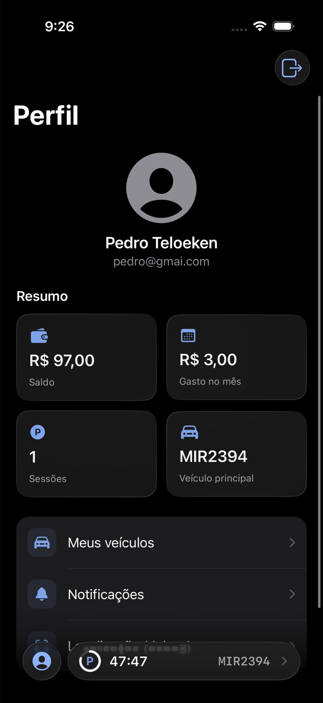
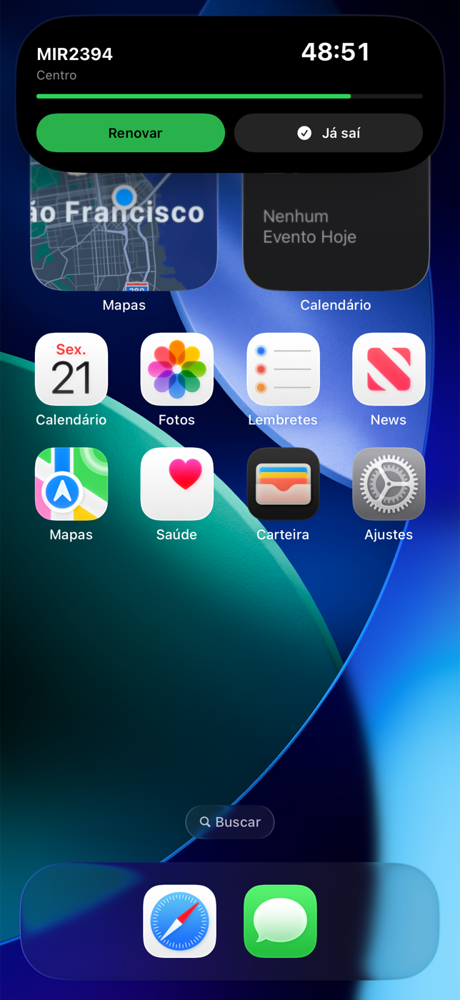
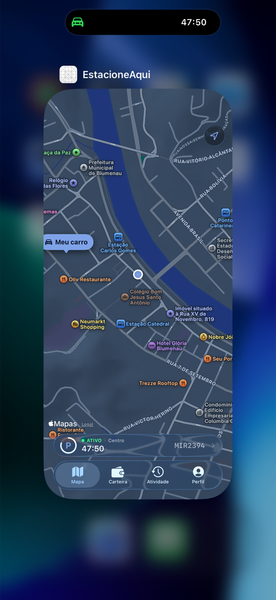

<div align="center">

# EstacioneAqui

### Sua Zona Azul, do mapa ao fim da sessão — sem complicação.

Um app iOS nativo que encontra áreas de estacionamento rotativo, mostra tarifas,
ativa o período pelo celular e mantém o motorista no controle até a hora de ir embora.

[](https://www.swift.org/)
[](https://developer.apple.com/xcode/swiftui/)
[](https://tuist.dev/)
[](#experiência-pensada-nos-detalhes)

</div>

<br>

<p align="center">
  
  &nbsp;
  
  &nbsp;
  
</p>

## Estacionar deveria levar segundos

O **EstacioneAqui** transforma uma tarefa urbana cheia de atrito em um fluxo simples: o app usa a localização do motorista para identificar a Zona Azul, apresenta preço e limite de permanência e permite iniciar uma sessão com o veículo já cadastrado.

Depois disso, o tempo restante continua visível dentro e fora do app. Se os planos mudarem, é possível estender a sessão; se for difícil lembrar onde o carro ficou, o mapa traça o caminho de volta.

## Tudo o que o motorista precisa

- **Áreas no mapa:** encontre zonas ativas por proximidade, com preço por hora e tempo máximo.
- **Detecção por localização:** saiba quando você já está dentro de uma área de estacionamento.
- **Ativação rápida:** escolha veículo e duração, confira o valor e estacione pelo app.
- **Sessão em tempo real:** acompanhe a contagem regressiva, estenda o período ou encerre antes.
- **Live Activity:** consulte o tempo e aja direto pela Dynamic Island ou Tela Bloqueada.
- **Encontre seu carro:** veja distância, estimativa a pé e abra a rota no Apple Maps.
- **Carteira integrada:** adicione saldo e acompanhe créditos, débitos e detalhes das movimentações.
- **Histórico e filtros:** consulte sessões anteriores por status e período.
- **Veículos e perfil:** gerencie placas, veículo principal, notificações e resumo de uso.

<br>

<table>
  <tr>
    <td align="center"><br><sub><b>Volte ao carro sem adivinhação</b></sub></td>
    <td align="center"><br><sub><b>Saldo e movimentações transparentes</b></sub></td>
    <td align="center"><br><sub><b>Tudo organizado em um só lugar</b></sub></td>
  </tr>
</table>

## A sessão acompanha você

A integração com **ActivityKit** leva o estacionamento para a Dynamic Island e para a Tela Bloqueada. O motorista vê placa, área e tempo restante sem precisar reabrir o app — e pode renovar ou informar que já saiu com poucos toques.

<p align="center">
  
  &nbsp;&nbsp;
  
</p>

## Experiência pensada nos detalhes

- Interface nativa em **SwiftUI**, com suporte a modo claro e escuro.
- Mapas, localização e rotas integrados ao ecossistema Apple.
- Estados de carregamento, erro e telas vazias tratados em toda a jornada.
- Atualização segura de sessão ao voltar para o app ou abrir uma ação por deep link.
- Acessibilidade e localização para **português do Brasil, inglês e espanhol**.
- Layout adaptado para iPhone, iPad e Apple Vision.

## Por baixo do capô

### Swift e SwiftUI

O aplicativo é desenvolvido nativamente em **Swift**, aproveitando segurança de tipos, performance e integração direta com os recursos da Apple. A interface utiliza **SwiftUI**, com componentes declarativos, gerenciamento de estado moderno, animações, suporte a modo claro e escuro e adaptação para diferentes dispositivos.

### MapKit e Core Location

O **MapKit** é responsável pela experiência de mapa: exibição das áreas de Zona Azul, posição do veículo, seleção de regiões e integração com rotas. O **Core Location** fornece a localização atual do motorista, permitindo identificar áreas próximas e verificar automaticamente se ele está dentro de uma zona ativa.

### ActivityKit e WidgetKit

As sessões de estacionamento continuam visíveis mesmo quando o app está fechado. Com **ActivityKit** e **WidgetKit**, o tempo restante, a placa e a área aparecem como uma Live Activity na Tela Bloqueada e na Dynamic Island. Deep links conectam ações como renovar ou encerrar diretamente à sessão correta dentro do app.

### Alamofire

A comunicação com a API utiliza **Alamofire**. A camada de networking centraliza requisições, autenticação, tratamento de respostas e conversão dos modelos recebidos pelo backend. O projeto também implementa renovação coordenada de token para recuperar sessões expiradas sem disparar várias atualizações simultâneas.

### Swift Concurrency

Operações assíncronas são escritas com **`async/await`**, deixando fluxos como login, carregamento das áreas, ativação do estacionamento e atualização da carteira mais legíveis. Tasks também mantêm a sessão sincronizada quando o app volta ao primeiro plano ou quando o tempo contratado termina.

### Observation

Os estados das telas são controlados com o sistema moderno de observação do Swift. View models e stores concentram dados, carregamento e erros, enquanto as views reagem automaticamente às mudanças. Isso reduz acoplamento e mantém a lógica de negócio fora dos componentes visuais.

### Pulse e PulseUI

Durante o desenvolvimento, **Pulse** e **PulseUI** registram e apresentam as chamadas de rede feitas pelo app. O console pode ser aberto ao chacoalhar o dispositivo, facilitando a inspeção de requests, responses e falhas sem depender exclusivamente do Xcode.

### Tuist e Swift Package Manager

O projeto é descrito em código e gerado com **Tuist**, garantindo uma configuração reproduzível de targets, schemes, build settings e dependências. O **Swift Package Manager** resolve bibliotecas externas, enquanto o `mise` fixa a versão das ferramentas e oferece comandos padronizados para gerar, compilar e testar o app.

### Localização e recursos nativos

Strings Catalogs (`.xcstrings`) organizam as traduções em **português do Brasil, inglês e espanhol**. O app também usa formatação nativa de datas, valores monetários e acessibilidade para respeitar o idioma e as preferências do dispositivo.

| Responsabilidade | Tecnologia |
| --- | --- |
| Linguagem e interface | Swift + SwiftUI |
| Mapas, posição e rotas | MapKit + Core Location |
| Dynamic Island e Tela Bloqueada | ActivityKit + WidgetKit |
| Comunicação com a API | Alamofire |
| Estado e tarefas assíncronas | Observation + Swift Concurrency |
| Inspeção de rede | Pulse + PulseUI |
| Geração do projeto | Tuist |
| Dependências | Swift Package Manager |
| Ambiente de desenvolvimento | mise |

## Organização do código

O código é dividido por funcionalidades — `Map`, `Wallet`, `History`, `Vehicles`, `Profile` e `ActiveSession` — para que cada jornada possa evoluir de forma independente. A pasta `Core` concentra capacidades compartilhadas, como autenticação, networking, localização, notificações e acesso aos serviços da API.

Os modelos recebidos pela rede são separados dos modelos usados pela interface e convertidos por uma camada de mapping. Assim, mudanças no contrato do backend têm menos impacto nas telas e a apresentação não precisa conhecer detalhes da API.

## Rodando o projeto

### Pré-requisitos

- macOS com uma versão do Xcode compatível com iOS 26.5
- [mise](https://mise.jdx.dev/) para instalar a versão correta do Tuist
- API do EstacioneAqui disponível em `http://localhost:8080`

### Preparação

```bash
git clone https://github.com/PedroTeloeken/estacioneaqui.git
cd estacioneaqui
mise install
mise run open
```

O último comando resolve as dependências, gera o workspace com o Tuist e abre o projeto no Xcode. Depois, selecione o scheme **EstacioneAqui** e execute em um simulador ou dispositivo.

### Comandos úteis

```bash
mise run generate  # gera o projeto sem abrir o Xcode
mise run build     # compila o app para iOS
mise run test      # executa os testes
mise run clean     # limpa artefatos e caches do Tuist
```

> A URL da API está centralizada em `EstacioneAqui/Core/Networking/APIConfig.swift` e pode ser ajustada para outro ambiente.

---

<div align="center">

Feito para que o motorista gaste menos tempo pensando onde estacionou — e mais tempo seguindo o caminho.

</div>
